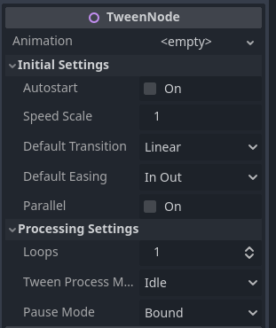
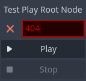
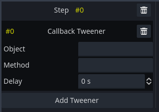
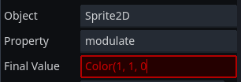
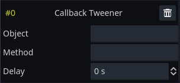
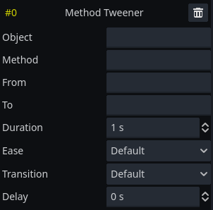

#  Godot Tween Suite

Tween Suite is an extension for Godot's Tween class. It adds 3 things: TweenNode, TweenAnimation, editor for TweenAnimation.

##  TweenNode

A wrapper for Tween. You can put it on the scene and edit some animation parameters in the inspector.



All of the parameters have documentation and mirror the Tween setup methods. Note that the properties shouldn't be changed while the Tween is animating.

The node will internally create a Tween and keep it valid as long as it exists. General usage is similar to AnimationPlayer - it has `play()`, `pause()` and `stop()` methods that do as their name suggest. The difference from AnimationPlayer is that TweenNode only has a single animation. For multiple animations you need multiple nodes.

The animation itself can be defined in a couple of ways.

#### Code animation

You can create TweenNode animation using code. Attach a new script that extends TweenNode and add `initialize_animation()` method. There you can define your animation like you would for a regular Tween.

```GDScript
extends TweenNode

func initialize_animation(tween: Tween):
    tween.tween_property($Sprite2D, "modulate:a", 0.0, 0.5)
    tween.tween_callback(queue_free)
```

This function is automatically called once, after the node is ready. The animation can then be played using `play()` or by enabling `autostart` in the node.

#### Animation resource

By assigning a TweenAnimation, the TweenNode will use it for the animation and won't call `initialize_animation()`. Similar to AnimationPlayer, you need to setup `animation_root` property to define the base node for your animation. See [TweenAnimation](#tweenanimation) for more info.

#### Creating reusable Tweens

By default, a regular Tween will autostart and become invalid once animation is finished. There is a way to create a Tween that does not autostart and stays valid and TweenNode makes that easier. Use the `create_reusable_tween()` static method to create a reusable Tween. The optional `autostart` argument specifies whether the Tween start automatically or not.

```GDScript
var tween: Tween

func _ready():
    tween = TweenNode.create_reusable_tween()
    tween.tween_property(self, "position:y", -100, 0.5).as_relative()

func jump():
    tween.play()
```

It's useful if you want reusable Tweens without using the node itself.

##  TweenAnimation

TweenAnimation is a new Resource introduced by this addon. You can use it both with TweenNode and a regular Tween. It defines Tweeners grouped in animation steps that can be applied to the Tween.

To use TweenAnimation with a TweenNode, simply put it in the `animation` property.


The `root_node` property is the Node relative to the TweenNode that will be used by the animation. All animation Tweeners that refer to objects will use that node as a base.

To use TweenAnimation in code, load the animation and call `apply_to_tween()` method.

```GDScript
var tween = create_tween()
var animation = load("res://tween_animation.tres")
animation.apply_to_tween(tween, self)
```

The method takes a Tween to which you want to apply the animation and a Node that will be root of the animation.

## TweenAnimation editor ("Tweens")

TweenAnimation is edited like most Godot resources. Double click a file in FileSystem or unfold a TweenNode `animation` and it will edit the resource, causing Tweens tab to appear at the bottom. This is how empty TweenAnimation editor looks.


### Playback controls

To the left are some controls for testing the animation. The root node is the base node for the animation, as already mentioned above. While it's a plain text box, it will display icon of the target node if it's valid and its name in the tooltip. You can also assign a Node from the scene using drag and drop.


The path is relative to the current scene's root. If it doesn't point to any node, the text becomes red and Play button is disabled.



By pressing the Play button, the editor will use the root node as a base and play the TweenAnimation using an internal Tween. The editor will automatically look for properties modified by the Tween and create a snapshot. Once the animation is finished or you press Stop, the changes caused by the animation will be reverted.

For safety reasons, the editor will play only PropertyTweeners and IntervalTweeners. Calling methods is unsafe (you could e.g. `queue_free()` a node accidentally), so CallbackTweeners and MethodTweeners are skipped.

### Animation editing

The darker panel that takes most of the editor's space is the animation's canvas. Before adding any steps, it only has an Add Step button. Pressing it will create an empty animation step.


Steps represent the Tween's animation steps that run in sequence. Empty step is just step index, delete button and Add Tweener button.

Each step then has any number of Tweeners that will run in parallel. Pressing the Add Tweener button will open a menu with all available Tweeners.


They are the same Tweeners that you can append to a Tween and the editor provides the same options for configuring them as available in code. Although, since the animation is serializable and can't have direct references to objects, there are some caveats. After you add a Tweener, a group of fields for editing it will appear, and like the step, it will have an index and a delete button. The Add Tweener button moves to the bottom and you can add another parallel Tweener.



Below are descriptions for every Tweener sub-editor.

#### Value fields

But before that, a short explanation of value fields. Due to plugin limitations, the value fields are plain text fields that evaluate their value to a Variant. The field becomes red if the value can't be properly evaluated.



If the value is valid, its tooltip will display the result of evaluation.


In general, this just means that you need to write your value by hand. There is a basic validation, but it doesn't check whether the value type matches the object's property etc.

#### Object fields

Fields labeled as Object take NodePath and can be either path to a node (e.g. `Sprite2D`) or path to a sub-resource (e.g. `Sprite2D:material`). The path is relative to the root node specified when the animation is applied to the Tween (the same one as the root of TweenNode).

Like with Test Play Root Node, the Object properties will display icon of the object they point to or turn red if the object can't be determined. Note that wrong path does not mean the animation is invalid, it just means that the editor can't resolve it currently and the animation will not play correctly.

The field will display icons both for nodes and objects and also allows dropping a node to assign it.


#### PropertyTweener

Equivalent of `tween.tween_property(object, property, final_value, duration)`.


- **Object:** Path to the target object.
- **Property:** The name of the property that will be animated, e.g. `modulate`.
- **Final Value:** The final value of this interpolation, expressed in a value field. Make sure the type matches the property's type.
- **Duration:** Duration of the interpolation in seconds.
- **Relative:** If enabled, the value will be relative to the value at the time of *playing* the animation. Equivalent of `tweener.as_relative()`.
- **Ease:** The easing method used for interpolation. Equivalent of `tweener.set_ease()`.
- **Transition:** The transition type used for interpolation. Equivalent of `tweener.set_trans()`.
- **From Current:** If enabled, the animation will start from the value at the time of *applying* the animation. Equivalent of `tweener.from_current()`.
- **From:** The initial value of the interpolation. If `null` (empty), it will be ignored. Enabling "From Current" will disable this property. Equivalent of `tweener.from()`.
- **Delay:** Time before this interpolation starts within the step. Equivalent of `tweener.set_delay()`.

#### IntervalTweener

Equivalent of `tween.tween_interval(time)`.


- **Time:** Time of the interval, in seconds.

#### CallbackTweener

Equivalent of `tween.tween_callback(object.method)`.



- **Object:** The target object.
- **Method:** The method in the target object to be called (e.g. `queue_free`).
- **Delay:** Time before the callback is called after the step begins. Equivalent of `tweener.set_delay()`.

#### MethodTweener

Equivalent of `tween.tween_method(object.method, from, to, duration)`.



- **Object:** The target object.
- **Method:** The method in the target object to be called (e.g. `set_modulate`).
- **From:** The initial value of the interpolation, expressed in a value field.
- **To:** The final value of the interpolation, expressed in a value field. Make sure it matches the type of "From" value.
- **Ease:** The easing method used for interpolation. Equivalent of `tweener.set_ease()`.
- **Transition:** The transition type used for interpolation. Equivalent of `tweener.set_trans()`.
- **Delay:** Time before this interpolation starts within the step. Equivalent of `tweener.set_delay()`.

___
You can find all my addons on my [profile page](https://github.com/KoBeWi).

<a href='https://ko-fi.com/W7W7AD4W4' target='_blank'></a>
